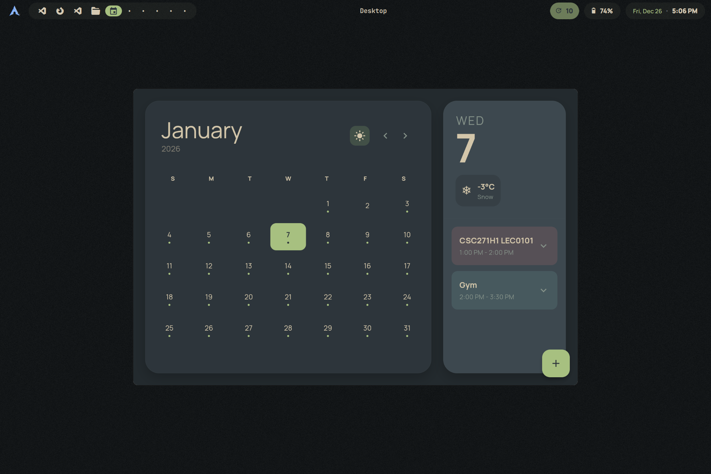
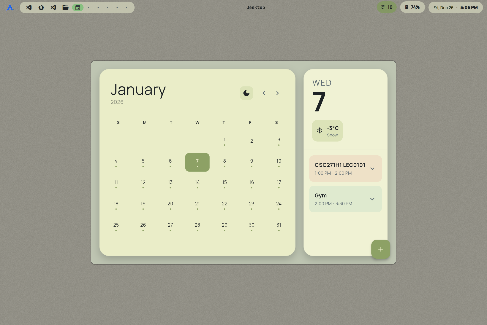

# EverCal

A simple calendar application written in Flutter.

I built this because I wanted a functional calendar that actually looked good on my Linux desktop. It is specifically designed to work seamlessly with tiling window managers like Hyprland.

[*Note: You need to manually import your ics from google calendar or outlook calendar with the + button*]
## Screenshots

<p align="center">
  
  
</p>

## Features

* **Clean UI:** Minimalist design that fits into any workflow.
* **Theme Support:** Built-in Light and Dark modes.
* **Tiling Friendly:** Zero-client-side decorations. It relies on the window manager for borders, making it look native on Hyprland, Sway, or other compositors.

## Installation

1.  Download `EverCal-Linux-Installer.tar.gz` from the [Releases](https://github.com/snes19xx/EverCal/releases) page.
2.  Extract the archive and run the installer script:

```bash
tar -xzvf EverCal-Linux-Installer.tar.gz
cd EverCal_Installer
sudo ./install.sh

